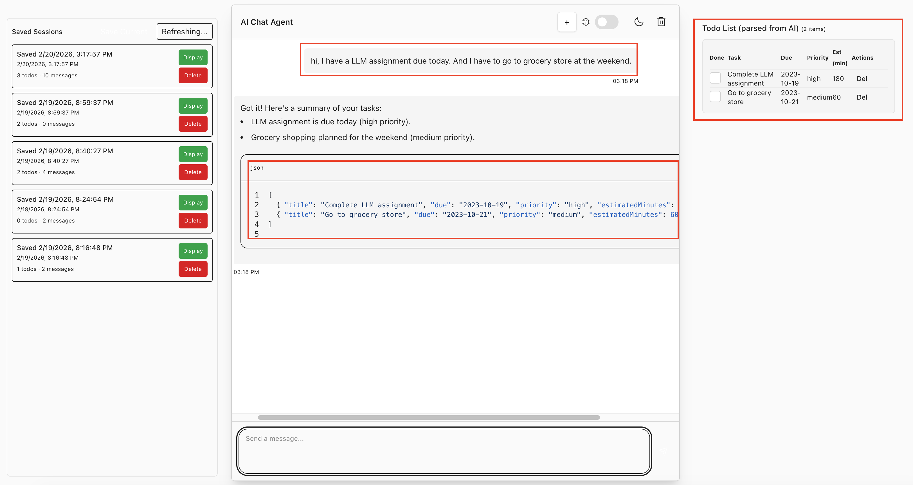
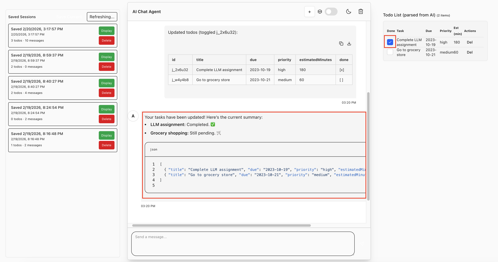

# 📋🤖 Todo List Agent

## Project Overview
This project is a Todo List Agent built on top of the [Chat Agent Starter Kit](https://github.com/cloudflare/agents-starter).

It demonstrates how to build a simple task management assistant with the following features:
- 💬 **Interactive AI Chat Interface:** Users enter natural language, and the AI parses it into structured Todo list items.
- 📅 **Todo Table Operations:** Supports viewing, deleting, and marking tasks as completed.
- 🔄 **State Management & Chat History:** Users can view and delete previous conversations and their associated Todo tables.

## Key Components

- **LLM:** OpenAI-style client @ai-sdk/openai with gpt-4o
- **Workflow / coordination:** Cloudflare Agents runtime + Durable Object persistence
- **User Input:** via chat UI built with React and Vite, hosted on Cloudflare Pages, communicating with the Agent via the `useAgentChat` hook
- **Memory / state:** Durable Object for session persistence, with in-memory state management for chat history and current tasks

## Prerequisites

- Node.js 18+ and npm
- Cloudflare account
- OpenAI API key (Find at [platform.openai.com](https://platform.openai.com/settings/organization/api-keys))


## Quick Start
1. Clone repository:
```bash
git clone git@github.com:xuxindi1220/cf_ai_todo_list_agent.git
```

2. Install dependencies:

```bash
npm install
```

3. Set up your environment:

Create a `.dev.vars` file:

```env
OPENAI_API_KEY=your_openai_api_key
```

4. Run locally:

```bash
npm start
```

Open browser http://localhost:5173 to interact with the agent.

5. Deploy:

```bash
npm run deploy
```

## Usages
**1. Add Todo Item via Chatbot**
   - Input via chat → LLM parses it into JSON → UI displays it in the Todo Table
   


**2. Todo Table Operations (Toggle and Delete)**
   - Mark as completed → LLM parses the instruction → Update status and refresh the UI
   

**3. View/Delete Chat History**
   - Click the "+" button to save the current session and create a new session.
   - The history panel supports viewing and deleting past sessions.
   